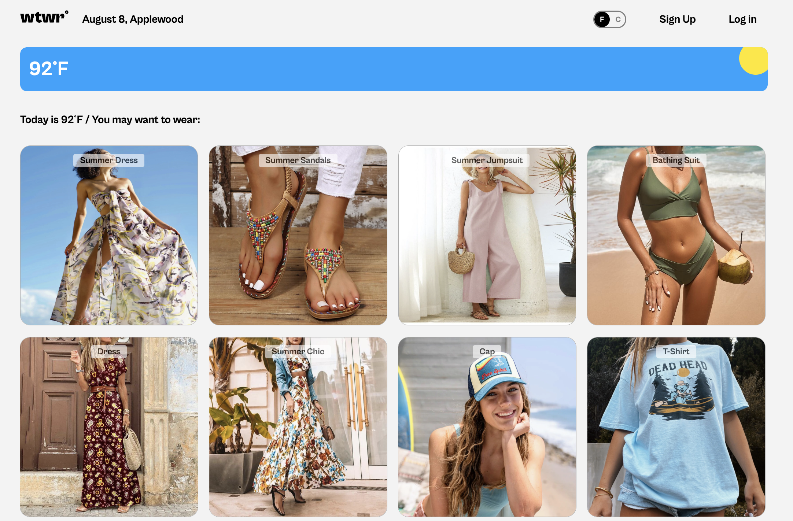

# WTWR (What to Wear?): Back End

_Weather-smart outfit recommendations, straight from your own wardrobe._

---

## Live Project

🌐 **Domain:** [https://www.wtwr.moonangel.com/](https://www.wtwr.moonangel.com/)

---

## Introduction

**What To Wear (WTWR)** is a weather-based clothing recommendation application.  
This repository contains the **Express.js back-end** that powers the app, managing user accounts, clothing data, and personalized outfit suggestions based on local weather.

---

## Project Goals

- Build a secure and scalable back-end API to support the WTWR application.
- Enable authenticated users to store and manage their clothing items.
- Integrate weather-based outfit recommendations using real-time data.
- Ensure robust input validation, error handling, and security best practices.

---

## What Was Done

The project was developed with **Node.js** and **Express.js**, connected to a **MongoDB** database. Key steps included:

1. **API Development**

   - Designed RESTful endpoints for user authentication and clothing item management.
   - Implemented CRUD operations for clothing items.

2. **Authentication & Authorization**

   - User sign-up/sign-in with secure password hashing using **Bcrypt**.
   - Token-based authentication with **JSON Web Tokens (JWT)**.

3. **Weather Integration**

   - Processed location data to fetch weather conditions.
   - Generated personalized outfit suggestions.

4. **Validation & Error Handling**

   - Used **Celebrate/Joi** for request validation.
   - Centralized error handler for consistent API responses.

5. **Security & Code Quality**
   - Enforced coding standards with **ESLint**.
   - Implemented secure password storage and protected routes.

---

## Features

- **User authentication** (signup/signin)
- **CRUD operations** for clothing items
- **Weather-based outfit recommendations**
- **Secure password handling**
- **Input validation**
- **Error handling**

---

## Technologies

- **Express.js** – Web framework
- **MongoDB** – Database
- **Node.js** – Runtime environment
- **JSON Web Tokens (JWT)** – Authorization
- **Bcrypt** – Password hashing
- **Celebrate/Joi** – Request validation
- **ESLint** – Code style enforcement

---

## Screenshots

**Homepage**  


**Profile**  


---

## Conclusion

The WTWR back-end successfully supports the application’s core functionality:

- Securely handles user accounts and clothing item data.
- Delivers accurate, location-based outfit recommendations.
- Provides a stable, maintainable API for future app features.

---

## Future Improvements

- **Add caching** using Redis to speed up repeated weather API calls.
- **Implement multi-language support** for global accessibility.
- **Expand recommendation logic** to factor in calendar events or special occasions.
- **Fix**: Optimize database queries using aggregation pipelines **to achieve** faster response times.

---

## Deployment & Requirements

**Requirements:**

- Node.js ≥ 18
- MongoDB ≥ 5.0
- npm ≥ 9.0

**Installation:**

```bash
git clone https://github.com/your-username/wtwr-backend.git
cd wtwr-backend
npm install
```
